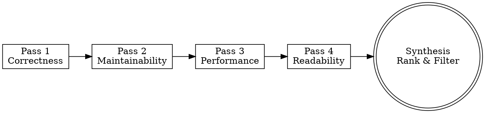

# Code Quality

> **Pillar**: Assure | **ID**: `assure-code-quality`

## Purpose

Multi-pass code review that identifies quality issues across correctness, maintainability, performance, and readability. Goes beyond linting — analyzes design intent and structural health.

## Activation Triggers

- "review this code", "code quality check", "refactor suggestions", "clean code"
- "what's wrong with this", "improve this", "code smell"
- When any file is shared for review

## Methodology

### Process Flow



### Pass 1 — Correctness
1. Identify logic errors, off-by-one, null/undefined risks, race conditions
2. Check edge cases: empty inputs, boundary values, error paths
3. Verify resource cleanup (connections, file handles, subscriptions)
4. Confidence-gate: only report findings ≥ threshold

### Pass 2 — Maintainability
1. Check function/class length — flag functions > 30 lines, classes > 300 lines
2. Identify code duplication (exact and near-duplicate)
3. Evaluate naming clarity — do names reveal intent?
4. Check coupling: does this code depend on internal details of other modules?
5. Apply SOLID principles where applicable (but don't lecture)

### Pass 3 — Performance
1. Identify O(n²) or worse patterns in hot paths
2. Flag unnecessary allocations in loops
3. Check for N+1 query patterns (if data access is involved)
4. Look for missing caching opportunities on repeated computations
5. Identify blocking calls that could be async

### Pass 4 — Readability
1. Assess cognitive complexity (nesting depth, boolean chains)
2. Check for magic numbers/strings
3. Verify consistent style within the file
4. Evaluate comment quality — helpful vs. noise vs. missing

### Synthesis
1. Rank all findings by severity: `critical > high > medium > low`
2. Filter by `severity_floor` from config
3. Group by file/function
4. Provide specific fix suggestions with code snippets

## Tools Required

- `codebase` — Read files and understand structure
- `crewpilot_metrics_complexity` — Get cyclomatic/cognitive complexity scores
- `crewpilot_metrics_coverage` — Check test coverage for reviewed code

## Output Format

```
## [CrewPilot → Code Quality]

### Summary
{N} findings across {files}: {critical} critical, {high} high, {medium} medium

### Findings

#### [{severity}] {title}
**File**: {path}:{line}
**Issue**: {description}
**Fix**:
\`\`\`{lang}
{suggested fix}
\`\`\`
**Confidence**: {N}/10

---
(repeat per finding)

### Recommendations
{top 3 structural improvements, if any}
```

## Chains To

- `test-first` — Write tests for areas with correctness concerns
- `vulnerability-scan` — If security-adjacent patterns are detected
- `change-management` — When fixes are ready to commit

## Anti-Patterns

- Do NOT report style preferences as quality issues
- Do NOT suggest heroic refactoring for stable, working code
- Do NOT report findings below the configured severity floor
- Do NOT rewrite the user's code in a different paradigm unless asked
